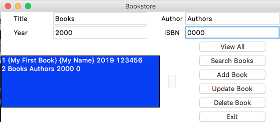

## Bookstore
  

  
A program that stores book information:
- Title
- Author
- Year
- ISBN

Users can:
- View all books
- Search for a book
- Add a new book
- Update a book record
- Delete a book

To use this program, download frontend.py and backend.py. Then run `python3 frontend.py` at your command prompt. If no database exists, a new one will be created. Otherwise, your database will populate the list of books.

